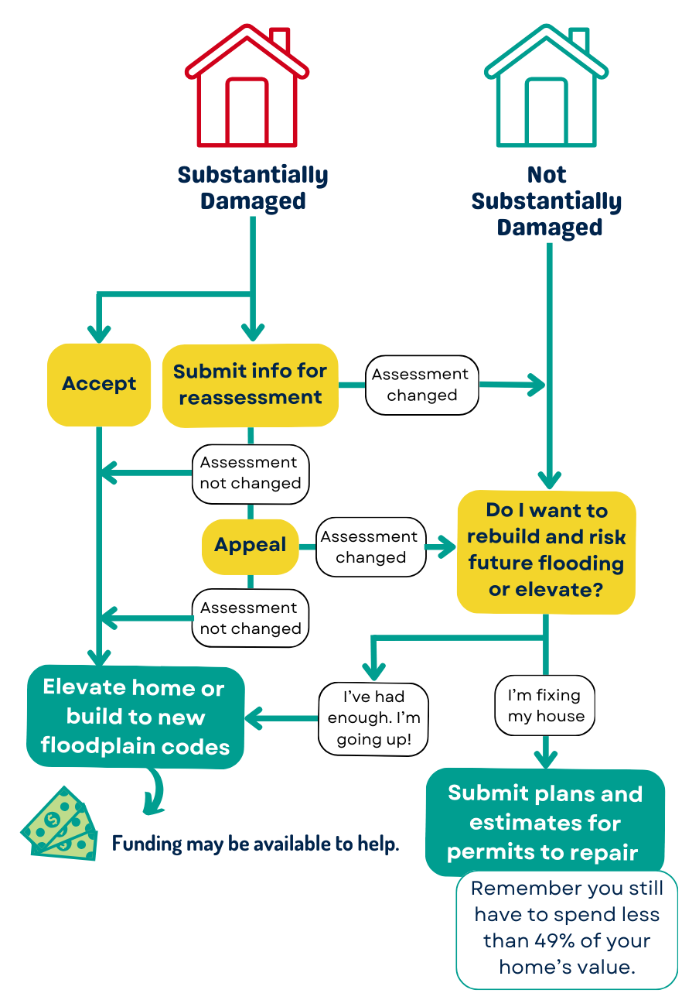

# FEMA50

This is where I document all the information I'm learning about the FEMA 50 rule

[Floodpoint Files](./FloodPoint)

## Pinellas County Substantial Damage and Substantial Improvement explained

This gives you some information on how Pinellas Country handles the ruling. If we find Largo's official text, we shall replace this one with it.

If you receive a letter in the mail stating that your home is Substantially Damaged, you are required to bring the structure up to flood safety standards. If you disagree with the determination, you may request a re-assessment.

Read more below:
[Substantial Damage and Substantial Improvement](`https://pinellas.gov/substantial-damage-substantial-improvement`)

## Getting your actual Depreciated Structure Value and your five year window start and end date from Largo

- Email: [askaplanner@largo.com](mailto:Askaplanner@largo.com)

## LARGO Homeowner Builder Affidavit

- [Affidavit](./Permitting/Owner%20Builder%20Affidavit.pdf)

## LARGO FEMA COST BREAKDOWN WORKSHEET INSTRUCTIONS

- [Worksheet](./FEMA50/FEMA_Cost_Breakdown%201.pdf)

## Finding your elevation certificate

- [FEMA Elevation Certificates](https://pinellas.gov/services/find-an-elevation-certificate)

## Largo Building Division

- [Largo Building Division](https://www.largo.com/building_services/index.php)
